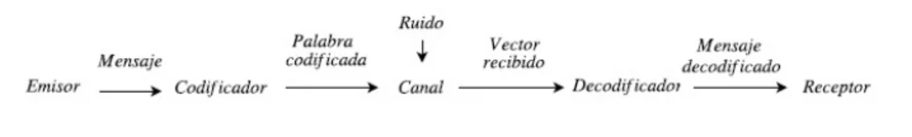

## Código de Golay binario _G24_

Teoría de Códigos, Laura Álvarez Iglesias

---

### 1. Introducción

El código de Golay binario _G24_ es un código (corrector de errores triples) sobre _Z2_ cuyos parámetros son _(24, 12, 8)_, su matriz generadora es de la forma _G = (I12 A)_ siendo _I12_ la matriz identidad de orden 12 y _A_ la matriz cuadrada 12x12

$$A=\begin{pmatrix}
0&1&1&1&1&1&1&1&1&1&1&1\\
1&1&1&0&1&1&1&0&0&0&1&0\\
1&1&0&1&1&1&0&0&0&1&0&1\\
1&0&1&1&1&0&0&0&1&0&1&1\\
1&1&1&1&0&0&0&1&0&1&1&0\\
1&1&1&0&0&0&1&0&1&1&0&1\\
1&1&0&0&0&1&0&1&1&0&1&1\\
1&0&0&0&1&0&1&1&0&1&1&1\\
1&0&0&1&0&1&1&0&1&1&1&0\\
1&0&1&0&1&1&0&1&1&1&0&0\\
1&1&0&1&1&0&1&1&1&0&0&0\\
1&0&1&1&0&1&1&1&0&0&0&1\\
\end{pmatrix}.$$

El objetivo de esta práctica es implementar el código de Golay binario _G24_ para la detección y corrección de errores en la transmisión de texto por un canal con ruido. El lenguaje de programación que se ha utilizado para la implementación es Python 3.
 

### 2. Funcionamiento

 

Primero se carga el archivo de texto que contiene la información a transmitir. Las palabras del texto se pasan a binario y, en caso de que la longitud de la palabra binaria no sea múltiplo de 12, se le añaden 1s para que sí lo sea. Seguidamente, estas palabras binarias se dividen en 12 bits cada una y se codifican utilizando el código binario de Golay. Luego, se obtienen segmentos de 24 bits del conjunto de palabras codificadas y se aleatorizan para simular el canal con ruido.
Para cada uno de estos segmentos de 24 bits recibidos se aplica el siguiente algoritmo para descodificarlos y comprobar si hubo algún error en la transmisión:

_**Algortimo:**_ Recibida una palabra binaria _**r**_ de longitud 24,
&nbsp;&nbsp;&nbsp;&nbsp;&nbsp;&nbsp;(i) Se calcula el síndrome de la palabra recibida, _**s**_ = _**r**_ _G tr_.
&nbsp;&nbsp;&nbsp;&nbsp;&nbsp;(ii) Si _w(**s**)_ $\leq$ 3, entonces el vector error es _**e**_ = _(**s, 0**)_.
&nbsp;&nbsp;&nbsp;&nbsp;(iii) Si _w(**s**_ + _**ai** )_ $\leq$ 2, para alguna fila _**ai**_ de la matriz _A_, entonces el vector de error es _**e**_ = _(**s**_ + _**ai** , **ui** )_.
&nbsp;&nbsp;&nbsp;&nbsp;(iv) Se calcula el segundo síndrome de la palabra _**r**_, _**s**A_.
&nbsp;&nbsp;&nbsp;&nbsp;&nbsp;(v) Si _w(**s**A)_ $\leq$ 3, entonces el vector error es _**e**_ = _(**0**, **s**A)_.
&nbsp;&nbsp;&nbsp;&nbsp;(vi) Si _w(**s**A_ + _**ai** )_ $\leq$ 2 para alguna fila _**ai**_ de la matriz _A_, entonces el vector error es _**e**_ = _(**ui** , **s**A_ + _**ai**)_.
&nbsp;&nbsp;&nbsp;(vii) Si todavía no se ha determinado el vector error _**e**_, se han producido más de tres errores.

Una vez detectado el error, para obtener la palabra corregida, tenemos que restarle el vector de error al vector que se ha transmitido previamente. Luego, guardamos las palabras transmitidas, tanto corregidas como sin corregir, y así podemos hacer una mejor comparación entre el texto enviado con errores y el corregido.

